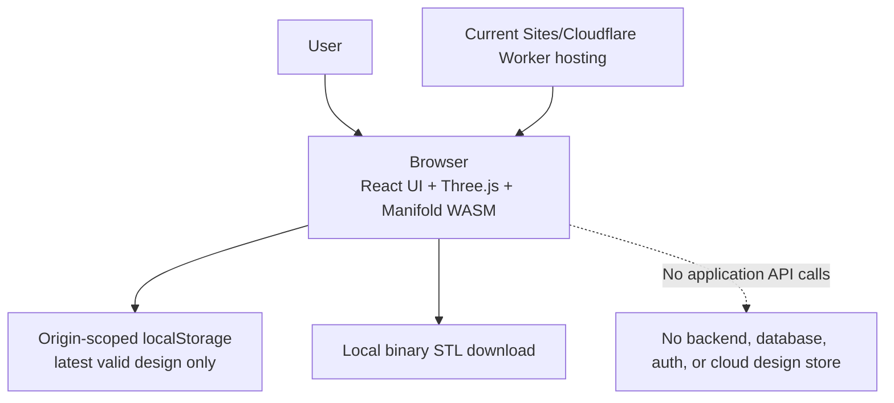
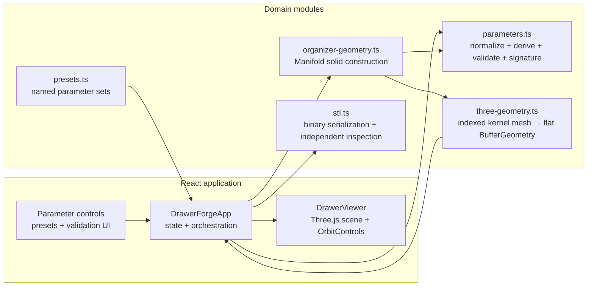
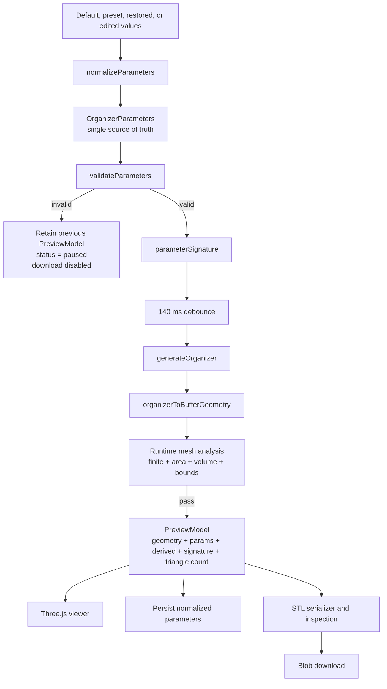
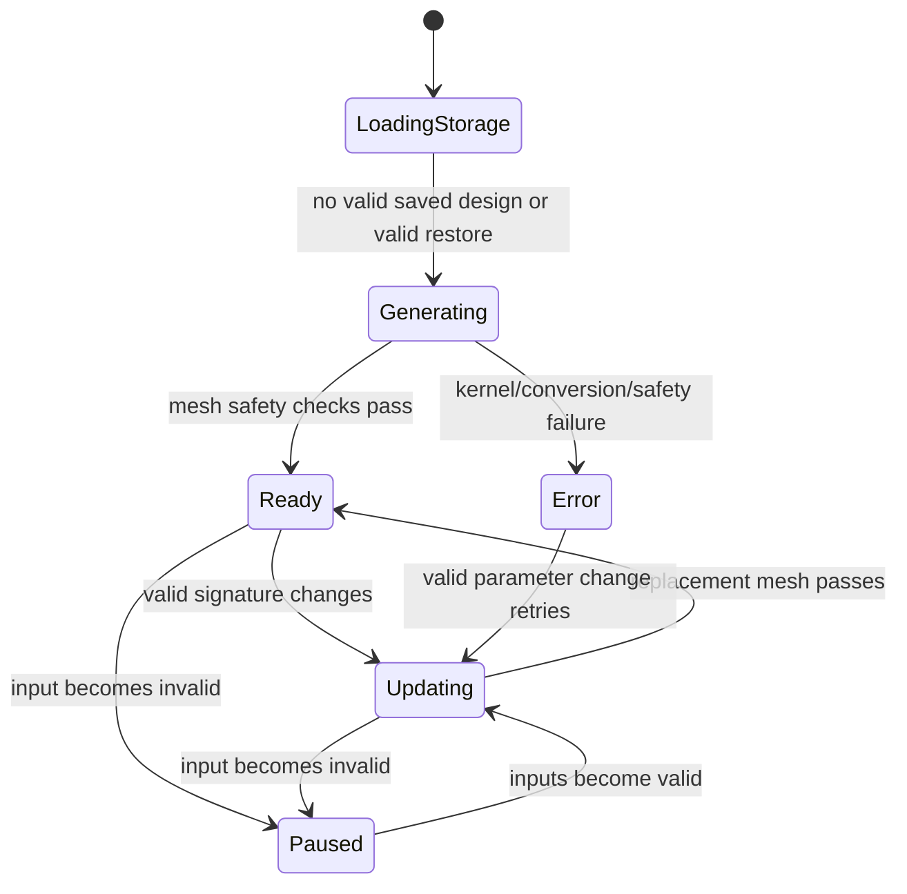
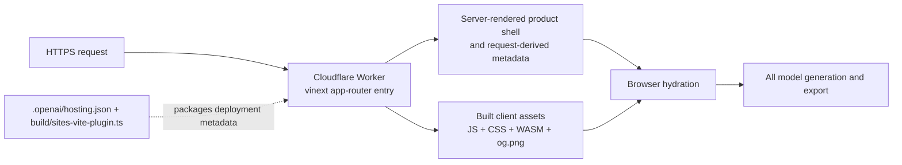

# System architecture

## Context

DrawerForge has a server-rendered application shell, but its product behavior is browser-only. The server supplies HTML, CSS, JavaScript, the Manifold WASM asset, metadata, and the Open Graph image. All parameter state, solid construction, rendering, persistence, STL validation, and download logic execute in the user's browser.



## Runtime component map



## Authoritative data flow



`PreviewModel` is the key consistency boundary. It carries the geometry, the normalized parameters used to create it, derived dimensions, the parameter signature, and triangle count. Export is disabled whenever its signature differs from the current UI signature or generation is not ready.

## UI state machine



Superseded jobs are not actually cancelled. A monotonically increasing `generationId` prevents stale results from replacing newer state, but old Manifold work can continue consuming the main thread until it finishes.

## Module responsibilities

| Module | Responsibility | Must not become responsible for |
|---|---|---|
| `lib/parameters.ts` | Canonical type, input normalization, ranges, formulas, cross-field validation, signatures, formatting | Geometry construction or UI state |
| `lib/presets.ts` | Valid named parameter snapshots and isolated copies | Mutating global/current design state |
| `lib/organizer-geometry.ts` | Manifold initialization and all Boolean solid construction | React, WebGL, file download, persistence |
| `lib/three-geometry.ts` | Convert kernel mesh to non-indexed Three.js geometry and inspect its numeric properties | Re-running parametric construction |
| `lib/stl.ts` | Serialize/parse-check binary STL and create deterministic names | Generating a different export mesh |
| `app/components/DrawerForgeApp.tsx` | Product state, debounce, validation orchestration, persistence, export workflow | Low-level solid primitives or renderer lifecycle |
| `app/components/DrawerViewer.tsx` | Long-lived Three.js scene, camera controls, framing, resizing, render-loop lifecycle, disposal | Owning parameter or export state |
| `app/layout.tsx` / `app/page.tsx` | HTML shell and dynamic social metadata | Product logic |
| `worker/index.ts` | vinext request dispatch and currently unused image-optimization route | Model generation |

## Three.js lifecycle

- One scene, camera, renderer, controls instance, model mesh, ground, grid, and light rig are created on viewer mount.
- The model mesh object remains stable; only its geometry is replaced.
- Replaced `BufferGeometry` objects are disposed.
- Scene materials/geometries, shadow maps, controls, observers, render lists, renderer, and WebGL context are disposed on unmount.
- The render loop pauses when an `IntersectionObserver` reports the viewer offscreen.
- Pixel ratio is capped at 2 to avoid excessive GPU cost on high-density displays.
- A `ResizeObserver` frames and resizes the model; a window resize fallback is provided.

## Current deployment architecture



Current platform coupling:

- `.openai/hosting.json` supplies Sites metadata and optional binding names.
- `build/sites-vite-plugin.ts` copies Sites metadata/migrations into `dist/.openai`.
- `vite.config.ts` imports the Sites metadata, installs the Sites build plugin, and configures placeholder D1/R2 bindings when present.
- `tests/rendered-html.test.mjs` asserts the hosting file exists.
- `worker/index.ts` and `@cloudflare/vite-plugin` are Cloudflare-specific but not Sites-specific.
- `app/layout.tsx` reads request headers to construct absolute metadata URLs, so the current shell is not a pure static export.

There is no configured Git remote at this snapshot. The repository is committed locally on `main`.

## Repository map

```text
app/
  components/
    DrawerForgeApp.tsx     Product state, controls, generation, persistence, export
    DrawerViewer.tsx       Long-lived Three.js viewer and lifecycle
  globals.css              Design tokens, responsive layouts, control states
  layout.tsx               Fonts, dynamic metadata, root document
  page.tsx                 Product route
lib/
  parameters.ts            Canonical parameters and validation
  presets.ts               Named starting designs
  organizer-geometry.ts    Manifold solid construction
  three-geometry.ts        Kernel-to-Three conversion and analysis
  stl.ts                   Binary STL writer and reader/inspector
tests/
  parameters.test.ts       Normalization, formulas, validation boundaries
  presets.test.ts          Preset validity and isolation
  geometry.test.ts         Bounds, volume, topology, continuity, quality
  stl.test.ts              Binary contract and independent parse
  app.integration.test.tsx UI state and export workflow with mocked viewer
  rendered-html.test.mjs   Production SSR shell and starter-removal checks
worker/index.ts             Cloudflare/vinext entry point
vite.config.ts              vinext, Sites, Cloudflare, and local sandbox config
build/sites-vite-plugin.ts  Sites packaging only
public/og.png               Social preview image
```

## Architecture pressure points for expansion

1. **Main-thread geometry:** labels, arbitrary dividers, splits, or fillets can make synchronous WASM work noticeable. Introduce a Web Worker before significantly increasing Boolean complexity.
2. **Manual WASM cleanup:** current happy paths delete Manifold objects, but new stages should use exception-safe cleanup patterns.
3. **Origin-scoped persistence:** changing domains without export/import can strand the only saved design.
4. **Unversioned geometry semantics:** persisted parameter version 1 does not identify the algorithm that turns those parameters into a physical part.
5. **Fixed tessellation:** quality levels are fixed segment counts, not target geometric error.
6. **No project boundary:** a single localStorage record is sufficient for v1 but insufficient for named projects, histories, sharing, or multiple parts.
7. **Experimental runtime:** `vinext` is currently part of the build. It should be retained for the lowest-risk direct Cloudflare migration, then revisited separately if portability becomes the priority.

