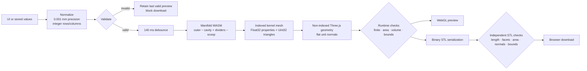

# Geometry and STL contract

This document is the compatibility contract for DrawerForge's current physical model. Any feature that changes the solid should either preserve these rules or introduce an explicit design/geometry version and migration policy.

## End-to-end geometry pipeline



The displayed model and downloaded STL use the same non-indexed `THREE.BufferGeometry`. Export does not regenerate geometry. The fixed-order parameter signature prevents a stale preview from being downloaded after controls change.

## Parameter contract

| Parameter | Default | Allowed range | UI step |
|---|---:|---:|---:|
| Drawer interior width | 300 mm | 80–600 mm | 1 mm |
| Drawer interior depth | 200 mm | 80–600 mm | 1 mm |
| Clearance per side | 0.5 mm | 0–5 mm | 0.1 mm |
| Organizer height | 50 mm | 15–120 mm | 1 mm |
| Outer wall thickness | 2 mm | 1.2–6 mm | 0.1 mm |
| Base thickness | 2 mm | 1.2–8 mm | 0.1 mm |
| Divider thickness | 2 mm | 1.2–6 mm | 0.1 mm |
| Outer corner radius | 8 mm | 1–40 mm | 0.5 mm |
| Rows | 2 | 1–6 | 1 |
| Columns | 3 | 1–8 | 1 |
| Mesh quality | Standard | Draft, Standard, Fine | — |
| Finger scoop | Enabled | Boolean | — |

### Normalization rules

- Supplied numeric values are converted with `Number` and rounded to 0.001 mm.
- Empty numeric input becomes `NaN`, allowing the validator to report it.
- Rows and columns are rounded to the nearest integer during normalization; for example, 2.6 becomes 3.
- Missing numeric fields receive defaults.
- Unknown mesh quality and non-Boolean scoop values fall back to defaults.
- UI steps are not validation constraints. A finite off-step value such as 2.123 mm is retained; the slider snaps on its next slider-driven change.

Do not casually reuse this tolerant normalizer for untrusted project-file import. A file importer should verify format/version and report rejected values rather than silently defaulting important fields.

## Derived-dimension formulas

Let:

- `Wd`, `Dd` = clear drawer interior width and depth
- `c` = clearance per side
- `tw` = perimeter wall thickness
- `td` = divider thickness
- `C`, `R` = columns and rows

Then:

```text
outsideWidth  = Wd - 2c
outsideDepth  = Dd - 2c
outsideHeight = organizerHeight

cellWidth = (outsideWidth - 2tw - (C - 1)td) / C
cellDepth = (outsideDepth - 2tw - (R - 1)td) / R
```

The default 300 × 200 mm drawer and 0.5 mm per-side clearance produce a 299 × 199 × 50 mm organizer. The nominal cell dimensions are approximately 97 × 96.5 mm.

Interpretation caveats:

- Clearance is removed on both sides, so 0.5 mm per side means a 1 mm total reduction on each axis.
- Nominal cell dimensions describe the regular grid spacing. Rounded corner cells lose rectangular footprint near the perimeter, and the front-center region may be altered by the scoop.
- No material shrinkage, elephant foot, slicer XY compensation, printer calibration, or intended fit force is modeled.
- The 0.5 mm clearance default is a practical starting assumption, not a validated fit guarantee.

## Validation invariants

Generation is permitted only when:

1. Every numeric parameter is finite and within its configured range.
2. Rows and columns are whole numbers.
3. Outside width and depth are positive.
4. `baseThickness <= organizerHeight - 4 mm`.
5. `cornerRadius <= min(outsideWidth, outsideDepth) / 2`.
6. Walls and dividers leave positive cells.
7. Nominal cell width and depth are each at least 10 mm.

Not checked today:

- Printer build volume or model splitting
- Nozzle diameter, line width, wall-line count, layer height, or material
- Shrinkage, fit calibration, and first-layer compensation
- Tall/slender divider stability
- Maximum generation time, triangle count, or browser memory
- Full runtime topology; manifold edge checks are test-only

## Coordinates and print orientation

- X is organizer width.
- Y is organizer depth.
- Z is height.
- The solid is centered around X=0, Y=0.
- The flat base lies on Z=0 and the part extrudes upward.
- Bounds are expected to be:
  - X: `[-outsideWidth / 2, +outsideWidth / 2]`
  - Y: `[-outsideDepth / 2, +outsideDepth / 2]`
  - Z: `[0, organizerHeight]`
- The front wall and scoop are on negative Y.
- The preview camera is explicitly Z-up.

The STL therefore opens in the intended flat-base print orientation in typical slicers, but STL itself carries no reliable units or orientation metadata.

## Solid construction

`manifold-3d` 3.5.1 is the constructive-solid-geometry kernel. Its WASM module is cached as a singleton, `setup()` is called once, and a failed initialization clears the cached promise so a later attempt can retry.

### 1. Rounded outer prism

The helper builds a centered rounded rectangle by offsetting a smaller rectangular core.

```text
safeRadius = max(0, min(requestedRadius, width / 2 - 0.01, depth / 2 - 0.01))
```

If `safeRadius < 0.01`, the profile is a simple rectangle. Otherwise a centered `(width - 2r) × (depth - 2r)` rectangle is round-offset by `r`. The outer profile extrudes from Z=0 through the organizer height.

An allowed requested radius exactly equal to half the shorter dimension is internally reduced by 0.01 mm, leaving a 0.02 mm straight span. If exact capsule/semicircle behavior matters later, this approximation must be revised and versioned.

### 2. Cavity and base

```text
innerWidth  = outsideWidth - 2 × wallThickness
innerDepth  = outsideDepth - 2 × wallThickness
innerRadius = max(0, cornerRadius - wallThickness)
```

The cavity starts at `z = baseThickness` and overtravels the top by 0.2 mm. Subtracting it from the outer prism leaves a solid base and continuous perimeter wall. When wall thickness exceeds corner radius, the inner corners become square.

### 3. Dividers

A fixed `BOOLEAN_OVERLAP` of 0.2 mm avoids coincident Boolean faces.

Each divider:

- Is an axis-aligned cuboid.
- Starts 0.2 mm below the cavity floor and extends 0.2 mm above the rim.
- Extends 0.2 mm beyond each outer end along its long axis.
- Is intersected with the original outer prism.
- Is unioned with the shell and other dividers.

Column divider center for `i = 1 … C-1`:

```text
x = -outsideWidth / 2 + wallThickness
    + i × (cellWidth + dividerThickness)
    - dividerThickness / 2
```

Row divider center for `j = 1 … R-1`:

```text
y = -outsideDepth / 2 + wallThickness
    + j × (cellDepth + dividerThickness)
    - dividerThickness / 2
```

Clipping dividers against the original outer solid before union is deliberate: it keeps divider ends inside the rounded perimeter and prevents the earlier cavity from compromising the shell.

### 4. Finger scoop

There is one automatic notch in a central front compartment, not one notch per
compartment. Odd-column grids keep it at X = 0. Even-column grids put it in
the left central compartment, near the middle divider.

```text
availableWallHeight = organizerHeight - baseThickness
scoopRadius = max(1.5,
                  min(12,
                      outsideWidth × 0.075,
                      availableWallHeight - 2,
                      cellWidth / 2 - 2))
even-column scoopCenterX = -(dividerThickness / 2 + 2 + scoopRadius)
odd-column scoopCenterX = 0
```

The 2 mm side clearance leaves solid front rim before each adjacent divider.
The cutter is a cylinder with its axis along Y. It begins 0.2 mm in front of
the outer edge and reaches `cornerRadius + wallThickness + 0.2 mm` behind that
edge, so it still crosses the rim where a large rounded corner curves inward.
Its center is:

```text
(scoopCenterX,
 -outsideDepth / 2 + (cornerRadius + wallThickness) / 2,
 organizerHeight)
```

The scoop is cut from the shell before divider union. This creates a U-shaped
notch open at the rim without cutting a column or row divider. The notch
bottom remains at least 2 mm above the base.

## Tessellation and mesh representation

| Quality | Segments for each 360° rounded feature |
|---|---:|
| Draft | 12 |
| Standard | 24 |
| Fine | 48 |

The same count is used for corners and the scoop and does not adapt to radius. At the 40 mm maximum corner radius, inferred maximum chord sagitta is roughly 1.36 mm Draft, 0.342 mm Standard, and 0.086 mm Fine. Draft can therefore look and print visibly faceted on large radii.

The kernel output is accepted only when `status() === "NoError"` and the solid is nonempty. Kernel arrays are copied into:

```ts
interface OrganizerMesh {
  numProp: number;
  vertProperties: Float32Array;
  triVerts: Uint32Array;
}
```

The kernel solid is then deleted. Conversion expands the indexed triangles into a non-indexed Three.js geometry with one flat unit normal per face. Degenerate faces with double-area at or below `1e-10` are rejected.

Runtime checks require:

- Finite positions and normals
- Positive face areas
- Positive signed volume/outward winding
- Bounds matching requested dimensions within 0.001 mm

The kernel's volume is retained but is not numerically compared with the later Float32 signed-volume calculation.

## Binary STL contract

The serializer writes standard little-endian binary STL:

| Section | Size |
|---|---:|
| Header | 80 bytes |
| Facet count | 4-byte unsigned integer |
| Each facet | 50 bytes |

Each facet contains a computed float32 normal, three float32 vertices, and a zero 2-byte attribute field. Total length must equal:

```text
84 + triangleCount × 50 bytes
```

The header begins with `DrawerForge binary STL · intended units: millimeters`, but this is informational; standard STL does not provide actionable unit metadata.

Before download, the app independently reparses the buffer and verifies:

- Nonzero facet count and exact byte length
- Finite normals and vertices
- Positive minimum triangle area
- Stored normal alignment with winding normal of at least 0.99999
- Facet count identical to the displayed mesh
- Bounds matching the displayed mesh within 0.0001 mm

The filename form is:

```text
drawerforge-<outsideW>x<outsideD>x<height>-<rows>x<columns>.stl
```

Values are rounded to two decimals, trailing zeros are removed, and the decimal point becomes `p`. Example: `drawerforge-299p5x199x47p5-2x3.stl`.

Filename identity is incomplete: designs that differ only in wall, base, divider, radius, scoop, or quality can collide.

## Geometry regression guarantees

Current tests prove the following for representative 1×1, 1×3, 2×3-with-scoop, and 4×4 cases:

- Kernel success, nonempty mesh, and positive volume
- Finite coordinates and normals
- Positive signed volume and outward winding
- One connected component
- Requested XYZ bounds and `min.z = 0`
- Non-degenerate triangles and unit normals
- Closed two-manifold edge topology: every quantized undirected edge occurs twice with opposite direction

Additional tests prove:

- The scoop preserves bounds while reducing volume.
- Triangle counts increase Draft → Standard → Fine.
- Cutlery and extreme valid-radius cross sections retain one exterior plus one closed hole per compartment.
- Binary STL matches preview facet-for-facet and bounds within `1e-5`.
- Three.js `STLLoader` independently parses the serialized result.

These are representative regressions, not exhaustive property tests across the full valid parameter domain.

## Rules for extending geometry

1. Add deterministic property/fuzz tests across parameter boundaries before adding several new Boolean features.
2. Preserve the same-preview/same-export invariant.
3. Avoid coplanar Boolean operands; document and test the tolerance/overlap policy.
4. Use `try/finally` or scoped helpers so every intermediate Manifold object is deleted on exceptions.
5. Move generation to a Web Worker before complexity makes edits block the UI.
6. Version geometry semantics whenever the same saved parameters would produce a materially different part.
7. Treat nominal cell width/depth as layout metrics, not guaranteed rectangular usable envelopes.
8. Add printer/material calibration before claiming physical dimensional accuracy.
9. Prefer a chord-error tessellation policy if rounded features expand significantly.
10. Add bed-volume checks before permitting automatic splits; splitting also needs joints, per-part naming, per-part validation, and multi-file/3MF output.
11. Review every undercut, magnet pocket, label, dovetail, fillet, or stacking feature for upright, support-free printing.
12. Consider 3MF alongside STL when units, multiple parts, or richer metadata become necessary.
