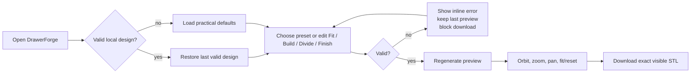

# UX and design specification

## Experience principles

1. **Measure first, model second.** The workflow begins with clear drawer dimensions, then construction and division choices.
2. **Keep consequences visible.** Derived dimensions, validation, preview state, and download readiness remain adjacent to controls.
3. **Never punish exploration.** Invalid edits retain the last valid model rather than blanking the viewer.
4. **Use workshop character without looking industrial or intimidating.** The design combines paper/copper control surfaces with a dark, dimensional preview stage.
5. **Make the safest path the easiest path.** Practical defaults, named presets, bounded inputs, and a disabled stale/invalid export reduce accidental bad files.

## Primary journey

## Information architecture

### Header

- DrawerForge brand mark/name
- Tagline: “Measure. Divide. Print.”
- Current local-save status
- Reset defaults action

### Left/control panel on desktop

1. Intro and outcome statement
2. Preset selection
3. Derived outside/cell dimensions
4. Fit: drawer width, depth, clearance
5. Build: height, walls, base, corner radius
6. Divide: rows, columns, divider thickness
7. Finish: mesh quality and finger scoop
8. Validation summary
9. Sticky STL export action and unit explanation

### Preview panel

- Persistent 3D model stage
- Fit model and Reset view controls
- Busy/ready/paused/error status pill
- Mouse/touch interaction hint
- Axis legend

## Responsive behavior

| Width | Behavior |
|---|---|
| Above 1100 px | Two-column shell; control panel is `clamp(390px, 34vw, 470px)` and preview fills remaining width |
| 960–1100 px | Two-column shell with fixed 390 px controls and reduced padding |
| Below 960 px | Stacked flow; sticky header, preview first at roughly 340–500 px high, controls second, document scrolling |
| Below 640 px | 58 px header, hidden tagline/save label, compact actions, 320–420 px preview, two-column preset grid, narrower numeric fields |

Desktop uses a viewport-height application shell with an independently scrolling control panel. On mobile, controls return to normal page flow to avoid nested-scroll traps. The export action stays sticky at the bottom of the controls and accounts for safe-area inset.

## Visual system

### Palette

| Token | Value | Role |
|---|---|---|
| Paper | `#efe9dd` | Page background |
| Panel | `#f8f4eb` | Main control surface |
| Panel bright | `#fffdf8` | Inputs/cards |
| Ink | `#1e2a24` | Primary text/dark derived card |
| Ink soft | `#526159` | Supporting text |
| Copper | `#a4451f` | Primary action/selection |
| Amber | `#e39a45` | Model and workshop accent |
| Teal | `#08746d` | Focus and switch-on state |
| Error | `#a3312a` | Invalid state |
| Success | `#3e6b52` | Valid/saved state |
| Viewer | `#17201d` | 3D stage |

The page uses a subtle 32 px paper grid, monospaced measurement labels, warm copper/amber accents, and an amber model on a dark workshop stage. Geist Sans and Geist Mono are loaded through Next fonts with system fallbacks.

### Model stage

- Amber `MeshStandardMaterial`, low metalness, medium roughness
- Dark ground plane and reference grid
- Hemisphere, warm key, and cool fill lights
- ACES filmic tone mapping and sRGB output
- Shadows and fog for depth separation
- Canonical isometric-ish camera direction and Z-up orientation

## Control behavior

### Numeric inputs and sliders

- Both controls reflect the same state immediately.
- Off-step numeric values are represented exactly.
- Out-of-range numeric edits remain visible rather than being clamped away; the slider temporarily expands to represent them and validation blocks export.
- Moving the slider again snaps to its configured step.
- Units and allowed ranges are visible.

### Presets

- Selecting a named preset replaces all parameters with a valid isolated copy.
- Any subsequent manual edit selects Custom.
- Selecting Custom does not erase the current design.

### Preview status

| Status | Meaning |
|---|---|
| Loading | No first model yet or WASM/model generation is beginning |
| Updating | A valid replacement model is being built |
| Ready | Current preview matches current normalized controls |
| Paused | Controls are invalid; last valid preview remains |
| Error | Kernel, conversion, runtime safety, or export failed |

### Download

The primary button is enabled only when:

- Validation passes
- A preview exists
- Preview signature matches current control signature
- Viewer is not loading/updating/error

Its supporting message distinguishes invalid settings from a stale/in-progress preview and always states the STL millimeter assumption.

## Accessibility decisions

- Root document language is English.
- Numeric slider and input pairs share programmatic labels.
- Inputs use `aria-invalid` and `aria-errormessage` for inline errors.
- The validation summary uses `role=status` when valid and `role=alert` when invalid.
- Preview is a named region with `aria-busy`, a polite live status, and a labeled toolbar.
- WebGL canvas is hidden from assistive technology; meaningful state is textual.
- Buttons and all form controls are keyboard-operable.
- Visible focus uses a 3 px teal outline with offset.
- The switch has native checkbox semantics plus `role=switch`.
- Busy changes do not block the rest of the interface.
- Reduced-motion preference effectively disables CSS transitions.
- Touch action is disabled only on the canvas so OrbitControls can handle gestures.
- Controls generally meet or approach practical touch sizes; primary download is 50 px high.

## Known UX gaps

- The viewer itself is visual; there is no textual geometric summary beyond dimensions/status.
- Integration tests mock WebGL and do not prove touch gestures, keyboard camera control, or screen-reader behavior.
- Local persistence has no named projects, manual save, history, or export/import.
- Origin changes make saved data appear lost.
- There is no progress indicator for long Manifold jobs and no true cancellation.
- No printer/build-volume context explains whether a valid 600 mm design fits a particular machine.
- Approximate cell dimensions can overstate usable corner/scoop space.
- The deterministic STL name cannot distinguish several geometrically different designs.
- The current viewport shell should be retested on browser zoom, landscape phones, and software-keyboard scenarios.

## UX guardrails for expansion

1. Keep beginner language and put advanced geometry behind progressive disclosure.
2. Show target dimensions, modeled dimensions, and printer compensation separately; do not silently alter user intent.
3. Any project import must be previewable and non-destructive until validation succeeds.
4. Any multi-part feature must clearly show part count, individual bounds, joining method, and download packaging.
5. Continue displaying a useful last-valid model when experimental edits are invalid.
6. Provide a low-cost calibration artifact before asking users to print a full drawer-sized tray.
7. Preserve responsive hierarchy: preview early on mobile, controls readable, export discoverable.
8. Add undo/redo before introducing interactions that can create many complex edits.

