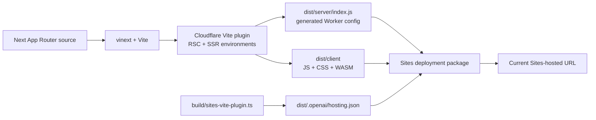

# Operations and migration

## Current state

DrawerForge is packaged for OpenAI Sites through a vinext/Vite/Cloudflare Worker build.



Current operational facts:

- There is no source-controlled `wrangler.jsonc`.
- There is no deploy script or CI workflow.
- Git is initialized and the local `main` branch is committed, but no remote is configured.
- `.openai/hosting.json` is tracked and contains the Sites project association; it has no D1 or R2 resources.
- The generated Worker serves a server-rendered shell and client assets.
- All business/product state remains browser-local.
- `worker/index.ts` exposes a vinext image-optimization route with an `IMAGES` binding even though the app does not use `next/image`; the binding is not configured in source.
- Metadata origin currently trusts forwarded/host headers to construct absolute URLs.

## Selected destination

The selected first migration is **direct Cloudflare Workers in the owner's Cloudflare account**, with:

- A private GitHub repository
- Cloudflare Builds connected to the repository
- Production deployments from `main`
- Preview versions from other branches
- Public production on a `workers.dev` address initially
- Cloudflare Access protecting previews
- Source-controlled Wrangler configuration
- No Terraform, custom domain, D1, R2, or other backend resource in phase one

This path preserves the existing app/runtime and minimizes the number of variables changed during the hosting cutover. A plain Vite SPA remains the preferred later option if provider portability becomes more important than minimal migration risk.

Useful official references:

- [Cloudflare Workers static assets](https://developers.cloudflare.com/workers/static-assets/)
- [Cloudflare Workers CI/CD](https://developers.cloudflare.com/workers/ci-cd/)
- [Cloudflare Worker custom domains](https://developers.cloudflare.com/workers/configuration/routing/custom-domains/)
- [Cloudflare Workers observability](https://developers.cloudflare.com/workers/observability/)

## Critical migration hazard: localStorage origin

`localStorage` belongs to a specific scheme/host/port. A design saved on the Sites origin will not appear on a new `workers.dev` or custom domain.

Ship a versioned design JSON export/import on the current origin before cutover:

```ts
interface DrawerForgeDesignV1 {
  format: "drawerforge-design";
  version: 1;
  name: string;
  units: "mm";
  parameters: OrganizerParameters;
}
```

Import must verify the format/version, normalize and validate parameters, and leave the current design untouched on failure. Do not claim an automatic cross-origin migration.

## Migration plan

### Phase 0 — Protect user state

1. Add design JSON export/import and tests.
2. Deploy this bridge release to the current Sites origin.
3. Tell existing users to download a design file before the host switch.
4. Confirm the exported file imports back into the current app.

### Phase 1 — Remove Sites-only coupling

1. Remove `.openai/hosting.json` imports from `vite.config.ts`.
2. Remove `build/sites-vite-plugin.ts` and the `sites()` plugin.
3. Remove placeholder D1/R2 configuration.
4. Update the rendered-HTML test so it no longer requires Sites metadata.
5. Keep vinext, the Cloudflare Vite plugin, App Router source, and Worker entry.

### Phase 2 — Create an explicit Worker contract

Add root `wrangler.jsonc` with:

- Worker name `drawerforge`
- Entry point `worker/index.ts`
- Pinned compatibility date
- `nodejs_compat`
- Static asset behavior produced by the build
- Stored observability enabled
- No D1, R2, KV, Images, queues, secrets, routes, or custom domain

Remove the unused `/_vinext/image` route and `IMAGES` interface unless the project intentionally adds/provisions image optimization.

Replace request-derived metadata origin with a trusted configured site origin or a carefully validated host strategy. Forwarded host headers should not be the long-term canonical URL authority.

### Phase 3 — Make releases reproducible

Add scripts with one documented artifact path:

```text
check             lint + typecheck + tests
build             vinext production build
deploy            build, then Wrangler deploy using generated Worker output
deploy:preview    build, then upload a preview version
```

The exact Wrangler command/config path should be verified against the generated output rather than relying on ignored `.wrangler/deploy/config.json` state.

### Phase 4 — Connect GitHub and Cloudflare Builds

1. Create a private GitHub repository and push `main`.
2. Configure Cloudflare Builds production trigger for `main`.
3. Configure other branches to build/check and upload preview versions.
4. Keep production credentials in Cloudflare, not in the repository.
5. Protect preview URLs with Cloudflare Access.
6. Confirm build logs and stored Worker logs are visible.

### Phase 5 — Hosted acceptance and cutover

1. Run the full automated suite in the build pipeline.
2. Execute the hosted browser QA checklist from `06_TESTING_AND_QA.md`.
3. Confirm WASM delivery, refresh, local save, JSON import, and STL download.
4. Import an exported Sites-origin design into the Worker-origin app.
5. Slice the production download and compare dimensions.
6. Keep the old Sites URL available during the observation window.
7. Retire/archive the old Sites deployment only after production passes and the user has transferred any needed saved design.

## Rollback

- Do not delete the current Sites deployment during initial Worker validation.
- Keep the previous known-good Worker version available for immediate rollback.
- A failed Worker cutover should not require source rollback to restore user access; point users back to the still-live Sites URL while diagnosing.
- Preserve exported design files across rollback. A project format should remain portable between the two origins.

## Monitoring baseline

For a browser-only application, server metrics mostly cover delivery rather than model success.

Monitor:

- Request volume, status distribution, latency, and uncaught Worker exceptions
- 404s for JavaScript, CSS, WASM, and `og.png`
- Build/deploy failures
- Client-side generation/export failures through privacy-conscious error telemetry only if explicitly added later
- WASM load duration and model-generation duration through local performance instrumentation

Avoid logging design dimensions or user-provided names by default if telemetry is later introduced.

## Secrets and data

- No application secrets are currently required.
- Do not place Cloudflare tokens, GitHub tokens, or account identifiers in tracked files.
- `.env*` files are ignored.
- Drawer dimensions may reveal personal/workspace context; keep them local unless the user explicitly chooses cloud storage or telemetry.

## Portability alternative

Because all product behavior is browser-side, DrawerForge can later become a standard React/Vite SPA:

- Replace `app/layout.tsx` and `app/page.tsx` with an HTML shell and React `createRoot` entry.
- Move metadata into static HTML/configuration.
- Replace `next/font` with local or system fonts.
- Remove vinext, Next, RSC, Worker, and Cloudflare runtime dependencies.
- Retain the Manifold `?url` WASM import, domain libraries, client components, CSS, and most tests.

That conversion improves provider independence but is deliberately separate from the first direct-Cloudflare migration.

